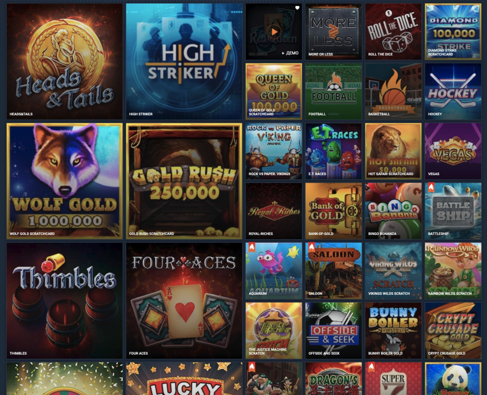

# Test task for a frontend developer

## Task
- load the `data/games List.json`file asynchronously
- implement a side menu that includes several items:
    - search by game title
    - from the `categories 'block to' gamesList.json`
    - "Favorites" with a counter for the number of games in this item
- to the right of the menu, display game tiles
    - for each category there is a list of games
    - if the game has the `top: true 'field, the image will be large' large`
    - all large images should be on the left in 2 columns, the rest take up all the remaining space on the screen
    - if the game does not have an image or is not available, then the placeholder and the name of the game should be displayed
- implement adding and deleting to favorites

## Requirements
- technologies
    - React.js/Redux
- design
    - at the discretion of the performer
    - adaptive
    - images, placeholders, and favorites icons are in the `assets`folder

### Example

